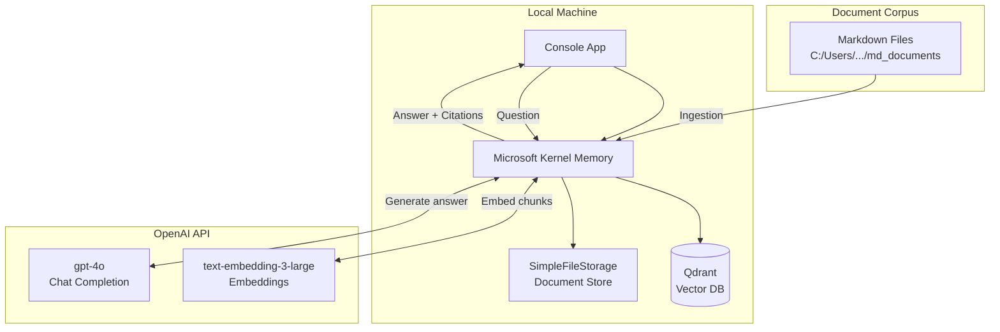
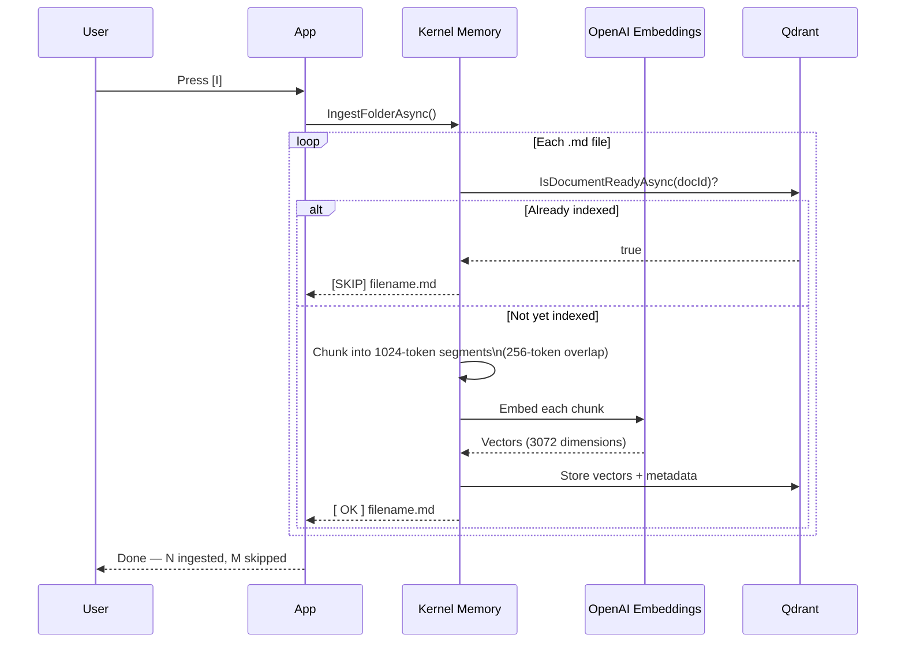
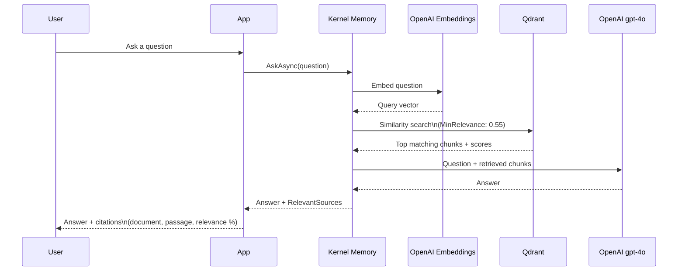

# RegulatoryRagBot

A Retrieval-Augmented Generation (RAG) chatbot for querying regulatory and compliance documents, built with .NET 10, Microsoft Kernel Memory, Qdrant, and OpenAI.

---

## Architecture



---

## Ingestion Flow



---

## Query Flow



---

## Prerequisites

| Requirement | Version | Notes |
|---|---|---|
| .NET SDK | 10.0+ | `dotnet --version` |
| Docker Desktop | any | To run Qdrant |
| OpenAI API key | — | Needs access to `gpt-4o` and `text-embedding-3-large` |

---

## Setup

### 1. Start Qdrant

```powershell
docker run -d --name qdrant -p 6333:6333 -p 6334:6334 qdrant/qdrant
```

On subsequent restarts:

```powershell
docker start qdrant
```

### 2. Configure

Copy `appsettings.example.json` to `appsettings.json` and fill in your values:

```json
{
  "OpenAI": {
    "ApiKey": "sk-...",
    "EmbeddingModel": "text-embedding-3-large",
    "ChatModel": "gpt-4o"
  },
  "Qdrant": {
    "Endpoint": "http://localhost:6333",
    "IndexName": "regulatory-docs"
  },
  "Ingestion": {
    "DocumentsPath": "C:\\path\\to\\your\\md_documents",
    "MaxTokensPerChunk": 1024,
    "OverlapTokens": 256,
    "MinRelevance": 0.55
  }
}
```

> **Important:** `appsettings.json` is listed in `.gitignore` and must never be committed — it contains your API key.

### 3. Run

```powershell
dotnet run
```

---

## Usage

The app presents a simple menu:

```
  [I] Ingest documents
  [Q] Ask a question
  [X] Exit
```

**First run:** press `I` to ingest your Markdown documents. Each file is chunked, embedded, and stored in Qdrant. Already-indexed files are skipped on subsequent runs — you only pay the embedding cost once per document.

**Subsequent runs:** press `Q` directly to ask questions against the existing index.

---

## Key Parameters

| Parameter | Default | Effect |
|---|---|---|
| `MaxTokensPerChunk` | 1024 | Size of each text segment stored in Qdrant. Larger chunks preserve more clause context; smaller chunks improve retrieval precision. |
| `OverlapTokens` | 256 (25%) | Tokens shared between adjacent chunks. Prevents information at chunk boundaries from being missed. |
| `MinRelevance` | 0.55 | Minimum cosine similarity [0–1] a retrieved chunk must reach to be included in the answer. Lower this (e.g. 0.3) if you get no results on a new corpus; raise it to reduce noise. |
| `EmbeddingModel` | `text-embedding-3-large` | 3072-dimension vectors. Higher accuracy than `-small` at ~2× cost — recommended for regulatory text where precision matters. |
| `ChatModel` | `gpt-4o` | Used for answer generation. Swap to `gpt-4o-mini` to reduce cost once output quality is validated. |

---

## Project Structure

```
RegulatoryRagBot/
├── Program.cs              # Entry point, menu loop, Q&A session
├── IngestionService.cs     # Folder scanning, chunking, embedding, skip logic
├── RagService.cs           # Question answering and citation display
├── MemoryFactory.cs        # Kernel Memory builder configuration
├── AppConfig.cs            # Typed configuration model
├── appsettings.json        # Runtime config — not committed (contains API key)
├── appsettings.example.json# Template for new contributors
└── km-storage/             # Kernel Memory document tracking (auto-created, not committed)
```

---

## Related

- [Microsoft Kernel Memory](https://github.com/microsoft/kernel-memory)
- [Qdrant](https://qdrant.tech)
